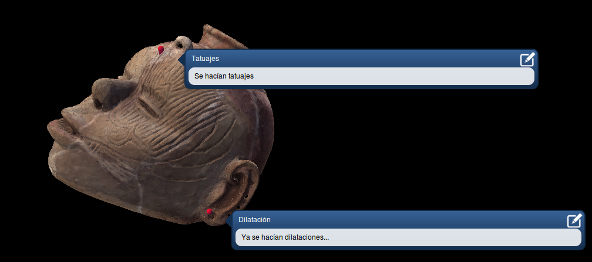

# ThreeDTagging
A 3D model viewer that make possible add points of interest to the model with a title and description.

The viewer uses [Threejs ](http://threejs.org/) javascript library, so it can be used in any compatible browser, included mobile devices.

## Installation

### 1. Download
You need the *ThreeDTagging* project files in your workspace:

    $ mkdir projectname
    $ git clone https://github.com/dasolma/ThreeDTagging projectname && cd projectname

### 2. Requirements
Right there, you will find the *requirements.txt* file. To install them, simply type:

`$ pip install -r requirements.txt`

### 3. Configuration

Now, you will need configurate the database to store the tags. You can review the [Django database documentation](https://docs.djangoproject.com/en/1.6/ref/databases/) to setup the dataset setting into the file setting.py. By default, it's configure to use sqllite3 database.

Next, it's the time to syncronize the database:

    $ python manage.py syncdb
    $ python manage.py migrate

## Acknowledgments

This work was partially supported by TIC-6064 Excellence project (Junta de Andalucía) and TIN2013-41086-P project (Spanish Ministry of Economy and Competitiveness), co-nanced with FEDER funds

